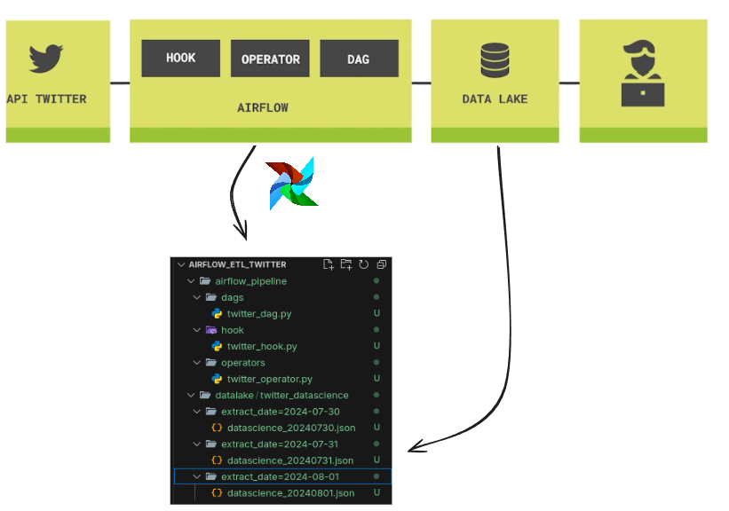

# airflow_etl_twitter

### Extração de dados da API do Twitter usando Apache airflow e carregando dados no data lake

<b>Objeto: Extrair os dados do Twitter de acordo com os post com #datascience</b>

</br>
Nesse projeto é feito a criação de hook pernsonalizado, operator personalizado e a dag.

#### Requerimentos

Instalar o Apache Airflow localmente ou Utilizar o docker.</br>
Obs: esse projeto está configurado para usar o Airflow localmente em modo standalone


Para instalar o Airflow localmente execute o comando abaixo com pip

`pip install 'apache-airflow==2.3.2' --constraint "https://raw.githubusercontent.com/apache/airflow/constraints-2.3.2/constraints-3.9.txt"`

Após a instalação se faz necessário o export da variavel abaixo de acordo com o path que você queira definir como home para o AIRFLOW

`export AIRFLOW_HOME=$(pwd)/airflow_pipeline`

Iniciando o airflow, execute o comando abaixo no teminal, faça o login com as credenciais exibidas no log.</br>
acesse: localhost:8080

`airflow standalone`


#### Configuração do Airflow

setar os parametros abaixo na UI do Airflow > connections
```
conection_id: twitter_default</br>
conexao type:  http </br>
host:  https://labdados.com</br>
extra:{"Authorization": "Bearer None"}</br>
</br>
```




OBS: Esse projeto utiliza um um endpoint de teste, para produção se faz necessário utilizar a API oficial do Twitter.